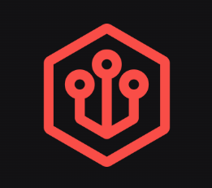

### Welcome to my Columbia Github Account 👋

I am a current senior at Columbia University studying computer science.

## Experience

| | | | |
|:--:|:--:|:--:|:--:|
| </img> | [Enoki](https://enoki.so) | Software Engineering Intern | January '23 - |
| </img> | [Meta](https://meta.com) | Software Engineering Intern | May - August '22 |

## Columbia University Courses

DATA STRUCTURES IN JAVA  
ADVANCED PROGRAMMING  
ARTIFICIAL INTELLIGENCE  
INTRODUCTION TO DATABASES  
FUNDAMENTALS OF COMPUTER SYSTEMS  
COMPUTER SCIENCE THEORY  
COMPUTATNL ASPECTS OF ROBOTICS  
NATURAL LANGUAGE PROCESSING  
USER INTERFACE DESIGN  
ENGR WEB3 BLOCKCHAIN APPS  
ELEMENTS FOR DATA SCIENCE  
APPLIED MACHINE LEARNING  
MOBILE APP DEVELOP IOS  
OPEN SOURCE DEVELOPMENT  

